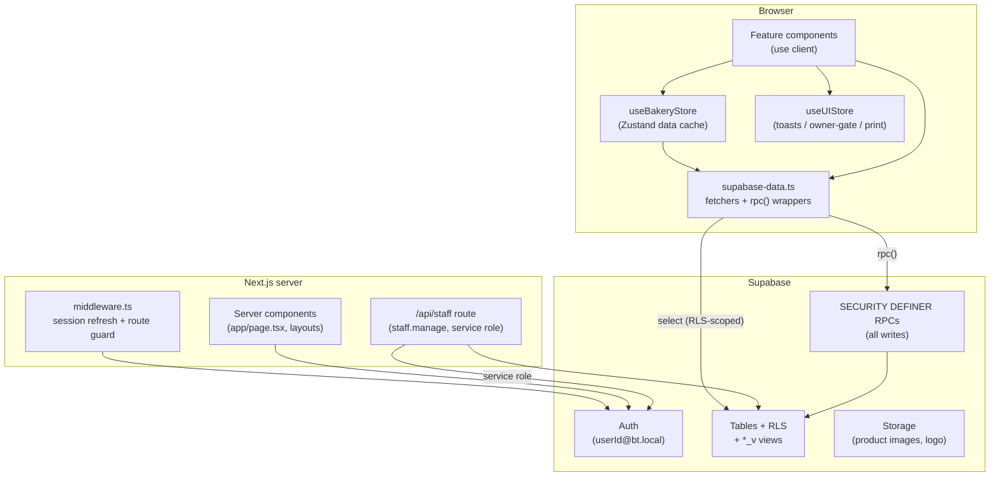

# Architecture — Bakers Theory (bt-store-management)

An in-depth reference for how this app is built and, more importantly, **why** it
is built this way. If you are joining the project, read **[ONBOARDING.md](./ONBOARDING.md)**
first — it gets you running and gives you a guided tour. Come here when you need
to understand a subsystem in depth.

---

## 1. What the app is

Bakers Theory is a single-store bakery management app: inventory (items + expiry
batches), point-of-sale billing with printed thermal receipts, a customer
directory, an analytics dashboard, and Excel report export. It is a **mobile-first
PWA** — most operators use it on a phone at the counter.

It was rewritten from an original single-file vanilla-JS app (global `state`,
`innerHTML` rendering, inline `onclick`) into a real React app, then moved from
browser-local storage to a Supabase backend. Several design choices only make
sense against that history — the app-facing type shapes (`src/lib/types.ts`) and
the pure logic layer were deliberately preserved across the migration so the UI
and its tests could stay stable while the storage layer changed underneath.

### Tech stack

| Concern | Choice |
|---|---|
| Framework | Next.js 14 (App Router, `src/` dir, no `pages/`) |
| Language | TypeScript (`strict`) |
| UI | React 18, utility-first Tailwind **v4** (CSS-first `@theme`) |
| Client state | Zustand (two stores: data + transient UI) |
| Backend | Supabase — Postgres, Auth, Row-Level Security, RPCs, Storage |
| Charts | Recharts (dashboard) |
| Excel export | `xlsx` (dynamically imported) |
| Icons | `lucide-react` + inline SVG |
| Hosting | Vercel (prebuilt CLI deploy, gated on GitHub Releases) |
| Tests | Vitest (jsdom) over the logic layer |

---

## 2. The one idea that explains everything

> **The browser is never trusted. Auth, authorization, and every write live in
> Postgres, not in JavaScript.**

Concretely:

- The client **reads** tables directly, but Row-Level Security (RLS) only lets it
  see what its permissions allow.
- The client **never writes** a table directly. Every mutation goes through a
  Postgres `SECURITY DEFINER` RPC that re-checks the caller's permission
  server-side (`is_owner()` / `has_perm()`) and performs the change atomically.
- Sensitive columns (`cost_price`) are **revoked** from the client role outright
  and exposed only through an analytics-gated RPC.
- The **service-role key** (which bypasses RLS) lives only on the server — used by
  the staff-management API route and the seed script, never shipped to the browser.

`src/lib/permissions.ts` (client) and the SQL helpers `is_owner()` / `has_perm()`
(server) are intentional mirrors of the same permission model. The client copy
drives UI (hide a nav item); the server copy is the actual enforcement. **Never
rely on the client copy for security** — it only decides what to render.

---

## 3. High-level shape


```mermaid
flowchart TD
  subgraph Browser
    UI["Feature components<br/>(use client)"]
    DS["useBakeryStore<br/>(Zustand data cache)"]
    US["useUIStore<br/>(toasts / owner-gate / print)"]
    SDK["supabase-data.ts<br/>fetchers + rpc() wrappers"]
    UI --> DS
    UI --> US
    DS --> SDK
    UI --> SDK
  end

  subgraph Edge["Next.js server"]
    MW["middleware.ts<br/>session refresh + route guard"]
    RSC["Server components<br/>(app/page.tsx, layouts)"]
    API["/api/staff route<br/>(staff.manage, service role)"]
  end

  subgraph Supabase
    AUTH["Auth<br/>(userId@bt.local)"]
    RLS["Tables + RLS<br/>+ *_v views"]
    RPC["SECURITY DEFINER RPCs<br/>(all writes)"]
    STG["Storage<br/>(product images, logo)"]
  end

  SDK -->|"select (RLS-scoped)"| RLS
  SDK -->|"rpc()"| RPC
  MW --> AUTH
  RSC --> AUTH
  API -->|"service role"| AUTH
  API --> RLS
  RPC --> RLS
```

**Reads** flow `component → store/supabase-data → RLS-scoped SELECT`.
**Writes** flow `component → store action → rpc() → SECURITY DEFINER function`.

---

## 4. Directory layout

Application code lives under `src/` (the documented Next.js convention), keeping
the repo root for config.

```
src/
  middleware.ts                 # session refresh + unauthenticated redirect
  app/
    layout.tsx                  # root: fonts, providers, system hosts, PWA meta
    page.tsx                    # server component: resolve session → redirect to default route
    login/page.tsx              # unauthenticated login
    globals.css                 # Tailwind v4 entry + @theme tokens + @media print
    (app)/                      # authenticated route group
      layout.tsx                # guards session, renders chrome (Sidebar/Topbar/BottomNav)
      dashboard/  stock/  bill/  history/  customers/  settings/  reports/
      attendance/                 # staff attendance: mark a day + history
      salary/                     # payroll, salaries, payment history
      cashbook/                   # the cash ledger: balances, transactions, manual entries
    api/staff/route.ts          # staff CRUD, staff.manage-gated (service-role, server-only)

  utils/supabase/               # the four @supabase/ssr clients
    client.ts                   # browser
    server.ts                   # server components / route handlers (anon key + cookies)
    middleware.ts               # session refresh in edge middleware
    admin.ts                    # service-role (server-only, bypasses RLS)

  lib/
    types.ts                    # app-facing domain types (the stable contract)
    store.ts                    # Zustand data store (base data + all write actions)
    ui-store.ts                 # Zustand transient UI store
    supabase-data.ts            # ALL data access: fetchers, mappers, rpc() wrappers
    auth.ts                     # userId↔email mapping, profile→User adapter
    permissions.ts              # client mirror of the permission model (drives UI)
    bill.ts                     # pure bill math (totals, tax, discount)
    analytics.ts                # pure dashboard aggregation helpers
    excel.ts                    # multi-sheet report assembly
    attendance.ts               # status weights, payable/unpaid-day math, CSV
    salary.ts                   # payroll arithmetic, period helpers, report rows
    report.ts                   # printable report documents (pure builders)
    payslip.ts                  # payslip document + amount-in-words
    expiry.ts  date-range.ts  format.ts  image.ts   # small pure helpers
    *.test.ts                   # Vitest suites (logic layer only)

  components/
    system/                     # invisible hosts mounted once in root layout
      AuthProvider.tsx          # auth context (session + profile)
      StoreHydrator.tsx         # kicks off store.load() once authed
      ToastHost / OwnerAuthHost / PrintHost / ServiceWorkerRegistrar / ...
      ReportPrintHost.tsx       # prints A4 reports & payslips (vs PrintHost's 80mm receipt)
    layout/                     # Sidebar, Topbar, BottomNav
    feature/                    # one folder per section — the "use client" boundary
      dashboard/ stock/ bill/ history/ customers/ settings/
      attendance/ salary/
      Guard.tsx  NoAccess.tsx
    ui/                         # shared primitives (Modal, Skeleton, DateRangePicker, ...)

supabase/migrations/            # ordered SQL: schema, RLS, RPCs, views
scripts/                        # seed-owner.mjs, release-notes.mjs
docs/                           # this file, ONBOARDING.md, supabase-schema-plan.md
.github/workflows/              # release.yml, deploy.yml
```

---

## 5. Auth & session flow

There are **two** places a session is checked, on purpose:

1. **`src/middleware.ts` → `utils/supabase/middleware.ts`** runs on every matched
   request. It refreshes the Supabase session cookie and, crucially, calls
   `supabase.auth.getUser()` (which validates the token server-side, not just
   reads the cookie). Unauthenticated requests to anything outside
   `PUBLIC_PATHS` (`/`, `/login`) are redirected to `/login`. This is the
   server-side gate.

2. **`app/(app)/layout.tsx`** is the client-side gate for the authenticated route
   group. It reads auth state from `AuthProvider` and redirects to `/login` if
   there is no user, showing a full-screen skeleton until auth resolves.

`app/page.tsx` is a **server component** that resolves the session once and
`redirect()`s a signed-in user straight to their default route
(`defaultRoute(user)` in `permissions.ts`) — so users don't bounce through
`/login` and a client round-trip on a warm session.

### The login handle trick

Users log in with a numeric **User ID** (e.g. `7873557430`), not an email.
`auth.ts` maps that handle to a synthetic Supabase Auth email
`<handle>@bt.local` (`userIdToEmail`). Supabase Auth only ever sees the email;
the handle is what humans type.

### AuthProvider — the subtle part

`AuthProvider` (`components/system/AuthProvider.tsx`) exposes `user`, `ready`,
`refresh()`, and `signOut()` via context. Two non-obvious rules are baked in and
must be preserved:

- **The `onAuthStateChange` callback is kept strictly synchronous.** Awaiting a
  Supabase DB call inside it can deadlock on the auth lock (notably on a hard
  reload), leaving `ready` stuck `false` and the page blank. The callback only
  sets the user id; the **profile fetch happens in a separate `useEffect`** keyed
  on that id, outside the lock.
- **`signOut()` clears the Zustand data cache** (`reset()` +
  `persist.clearStorage()`) so the next user on a shared device never inherits
  the previous user's items — which include private cost prices.

`StoreHydrator` is a render-null host that calls `store.load()` once
`ready && uid` — this is what connects "user is authenticated" to "fetch the
store data."

---

## 6. Client state — two Zustand stores

### `lib/store.ts` — the data store (`useBakeryStore`)

Holds the **bounded, slow-changing base data**: bakery settings, the item
catalogue, and the option lists. It also owns **every write action** (they call
the `rpc*` wrappers and then reconcile the local cache).

Design points that matter:

- **Persisted to `localStorage`, but only base data.** `partialize` caches
  `{ bakery, items, lists }` — never actions, the hydration flag, or unbounded /
  time-sensitive data (bills, dashboard). An SSR-safe no-op storage is used on
  the server where `localStorage` doesn't exist.
- **Stale-while-revalidate hydration.** `load()` paints cached data immediately
  (`_hasHydrated`) if present, then revalidates from Supabase in the background.
  A failed background revalidation over good cached data stays silent; only a
  *cold* failure (nothing cached) raises `loadError`, which the app layout shows
  as a retry banner.
- **Surgical cache updates, not full reloads.** Item-scoped RPCs
  (`create_item`, `update_item`, `stock_in`, …) return the affected `items_v`
  row, so the store `patchItem`s a single entry instead of re-downloading the
  catalogue. Bills touch many items via FIFO, so `generateBill` does a bounded
  `refreshItems()` (still cheaper than the old full base-data reload, since
  settings/lists don't change).
- **Bills and logs are deliberately *not* in this store.** The dashboard reads
  server-computed aggregates (`dashboard_stats` RPC) and History paginates
  (`fetchBillsPage`). This keeps the always-loaded cache small.

### `lib/ui-store.ts` — transient UI (`useUIStore`)

Ephemeral, never persisted: the toast queue, the **owner-password gate**
(`requireOwnerAuth(label, onConfirm)` — a confirm-with-password flow for
destructive owner actions), and the **thermal-receipt print target**. Each slice
is surfaced by a matching host in `components/system/` (`ToastHost`,
`OwnerAuthHost`, `PrintHost`). A top-level `toast()` helper lets non-render code
fire a toast.

---

## 7. Data access — `lib/supabase-data.ts`

This is the single module through which the client talks to Supabase. It has four
responsibilities:

1. **Row shape interfaces** (`ItemRow`, `BillRow`, …) — the DB wire shapes.
2. **Mappers** (`mapItem`, `mapBill`, …) — DB row → app type (`snake_case` →
   `camelCase`, `null` → sane defaults, and `Number()` coercion for
   Postgres `bigint`/`numeric` values that arrive as **strings** over the wire).
3. **Fetchers** — bounded ones (`fetchBaseData`, `fetchItems`, `fetchSettings`,
   `fetchLists`), paginated ones (`fetchBillsPage`, `fetchLogsPage`,
   `fetchAdminLogsPage`), server-aggregated (`fetchDashboardStats`), cheap
   HEAD-count previews (`fetchReportCounts`), and the one unbounded fetch
   (`fetchReportData`, used *only* by the on-demand Excel export).
4. **RPC wrappers** — a private `rpc<T>(fn, args)` helper (throws a clean message
   on error) wrapped by typed functions like `rpcGenerateBill`, `rpcStockIn`, etc.

Conventions worth knowing:

- **Reads hit views, not base tables, where a view exists.** `items_v`, `bills_v`,
  `activity_log_v`, `activity_log_admin_v` join in derived fields (e.g. batches,
  biller name) and/or scope rows. `bills_v` exposes `biller_name` joined from
  `profiles`; `activity_log_admin_v` returns nothing for non-owners.
- **Local-day ↔ UTC conversion is explicit.** `timestamptz` columns are filtered
  by the **user's** calendar day, not the server's: `dayStartISO` / `dayEndISO`
  convert a local `YYYY-MM-DD` to UTC instants, and the client timezone is passed
  to `dashboard_stats` / `generate_bill` (which decide batch-expiry server-side).
  This must stay consistent across the dashboard, history filters, bill
  generation, and Excel `inRange`.
- **Search is sanitized.** `orSafe()` strips PostgREST `.or()` grammar chars from
  user queries so a search string can't break the query.
- **One intentional error-swallowing site:** `fetchCustomerByPhone` returns `null`
  on *any* failure (including RLS/network) because a failed autofill lookup must
  never block a bill. The comment there explicitly warns not to copy that pattern
  elsewhere — Dashboard/Customers surface failures instead.

---

## 8. The write path & security model

### Everything mutating goes through an RPC

Client code never runs `INSERT`/`UPDATE`/`DELETE`. Instead it calls a Postgres
function declared `SECURITY DEFINER` (runs as the function owner, bypassing the
caller's RLS) that:

1. Re-checks its own specific permission first: `if not
   public.has_perm('stock.in') then raise exception 'forbidden'; end if;` (or
   `is_owner()` for the two ungrantable ops).
2. Performs the change **atomically** (multi-step operations like `generate_bill`
   — compute totals, insert bill + lines, decrement stock FIFO, write the
   activity log — happen in one transaction, with `for update` row locks where
   concurrent stock matters).
3. Returns the affected row (for cache patching) or `void`.

Each RPC checks one key: `create_item` → `items.create`, `update_item` /
`set_item_image` → `items.edit`, `delete_item` → `items.delete`, `stock_in` →
`stock.in`, `stock_out` → `stock.out`, `write_off_batch` /
`update_batch_expiry` → `stock.expiry`, `generate_bill` → `bill.create` (plus
`bill.discount` when the payload carries one), `cancel_bill` → `bill.cancel`,
`delete_bill` → `bill.delete`, `update_customer` → `customers.edit`,
`save_settings` / `update_logo` → `store.settings`, `set_store_status` →
`store.status`, `add_list_value` / `delete_list_value` → `store.lists`.
`clear_all_data` stays `is_owner()`. Each is `grant execute … to authenticated`.

`update_item` writes `cost_price` **only** for `items.cost` holders — otherwise it
preserves the stored value, since `items_v` hands those callers `null` and a blind
write would zero the purchase price.

### RLS + permission helpers

RLS is enabled on every table. Policies read the SQL helpers:

- `my_role()` — the caller's role from `profiles`.
- `is_owner()` — `my_role() = 'Owner'`.
- `has_perm(perm)` — Owner implicitly has all; otherwise `perm = any(profiles.perms)`.
  It also resolves the three legacy group keys (`sales` / `inventory` /
  `analytics`) as "holds any permission in that area", so policies written before
  the granular migration (`0028`) keep behaving as they did.

Read policies: items / stock_batches readable by `stock.view`, `bill.create`,
`dashboard.view` or `reports.view` (a cashier has no Stock page but must still
read the catalogue to bill); bills / bill_items likewise; activity_log gated on
`activity.view`; customers on `customers.view` or `bill.create`; store_settings
readable by any authed user, writable with `store.settings`; profiles readable by
self-or-`staff.manage`, writable with `staff.manage` and never for the Owner's
row. Writes on the data tables have **no** client policy — they're unreachable
except through the definer RPCs.

### Roles are presets, not stored authority

`profiles.role` is only ever `Owner` or `Staff`. **Admin, Manager, Cashier and
Storekeeper are presets** (`ROLE_PRESETS` in `lib/permissions.ts`): choosing one
stamps its key set into the user's `perms`, which is the only thing enforced. The
badge a staff member displays is computed back from their set by
`presetForPerms()`, so a stored label can never contradict the actual grants — a
set matching no preset simply reads as `Custom`, and an empty one as `No access`.

Current shape (see `ROLE_PRESETS` for the authoritative lists):

| Area | Admin | Manager | Cashier | Storekeeper |
|---|:-:|:-:|:-:|:-:|
| Dashboard (incl. profit) | ✓ | – | – | – |
| Billing | ✓ | – | ✓ | – |
| Stock & items | ✓ | ✓ | – | ✓ |
| Customers | ✓ | ✓ | ✓ | – |
| Reports | ✓ | ✓ | – | – |
| Store profile | ✓ | – | – | – |
| Open/close + lists | ✓ | ✓ | – | – |
| Activity log | ✓ | ✓ | – | – |
| Attendance | ✓ | ✓ | – | – |
| Salary & payroll | – | – | – | – |
| Manage staff | – | – | – | – |

Deliberate choices worth preserving:

- **No preset grants `*.delete`** (bills or items) except Admin. Nor does any
  preset grant `staff.manage` or the three `salary.*` keys — see
  `OWNER_BY_DEFAULT` in `permissions.ts`. Cancelling a bill and writing off a
  batch leave an audit trail; deleting leaves nothing. Staff management and
  payroll stay with the Owner but remain in the catalogue, so each can be
  delegated to one individual by hand without handing over a whole preset.
- **Cashier and Manager are disjoint** apart from `customers.*` — the counter and
  the back of house are separate jobs. A test pins that intersection so future
  edits can't quietly blur them.
- **Two capabilities have no key at all** and are unreachable by anyone but the
  Owner: `clear_all_data()` and `activity_log_admin_v` (staff / password /
  settings events).
- **Editing a preset does not retro-apply.** Presets are TypeScript; existing
  staff keep the set they were given and must be re-assigned in Settings.

### Cost-price privacy

`cost_price` is commercially sensitive. It is **revoked at the column level** from
`authenticated`/`anon` on both `items` and `bill_items` (see migration 0002).
Two separate permissions govern it: `items.cost` (see and set a purchase price)
and `dashboard.profit` (see margin / COGS / P&L), so a storekeeper can record
supplier prices without ever seeing profitability. `bill_lines_with_cost()`
returns rows only to `dashboard.profit` / `reports.export` holders, and
`dashboard_stats` returns `cogs: null` without `dashboard.profit`. The client mappers hard-code `costPrice: 0` on bill lines so
cost never even has a client-side field to leak into.

### The cash ledger

Every money event writes a `cash_entry` row **inside the same transaction as its
source**. `generate_bill` inserts the bill and its ledger row together;
`cancel_bill` writes a *reversing* row rather than editing the original. That is
the whole design, and three rules follow from it:

- **`post_cash` is the only insert path.** It owns the mode→account map
  (`mode_to_account`: `Cash → cash`, everything else `→ bank`), the leaf-category
  check, and the no-future-date rule — so those cannot drift across the ten call
  sites.
- **Corrections are reversals, not edits.** `reverse_cash` writes an opposite row
  with `reverses_id` pointing back, and it is idempotent, so a cancel followed by
  a delete does not double-reverse. From Phase B, a reversal against a *closed*
  day lands on the current open day instead of rewriting a counted one.
- **Nothing is hard-deleted.** Removal is `deleted_at`; a trigger refuses `DELETE`
  outright, and refuses `UPDATE` on any row whose `source_type <> 'manual'`.

Purchase invoices and purchase returns are **not** cash events: an invoice creates
a payable and a return is a credit note against it. Cash moves only when a
`supplier_payment` is recorded. Likewise `delete_salary_payment` has no ledger
hook — it already refuses to touch a paid record, so a paid salary can only reach
deletion through `mark_salary_unpaid`, which does reverse.

`assert_cash_day_open()` and `reversal_date()` ship in `0045` as **stubs at their
final signatures**, called by all nine money RPCs. Phase B fills in their bodies,
which arms the day lock everywhere without touching a single call site.

### Expenses: document and posting

An expense is a **document**; a `cash_entry` is its **posting**. This is the same
relationship `purchase_invoice` → `supplier_payment` already has. Three
consequences worth knowing:

- **The workflow is two paths, one hop.** A holder of `expense.pay` records a paid
  expense in one step. Anyone else records a `pending` one that an approver
  approves-*and*-pays in a single action. There is deliberately no
  "approved but unpaid" state — that is a *payable*, and suppliers already own
  payables here. `draft` and `approved` from #32 do not exist.
- **A Mixed payment is one document and two ledger rows**, one per account,
  sharing the expense's `source_id`. This is why `cash_entry_source_uniq` keys on
  `account`, and why cancelling a Mixed expense writes two reversals.
- **The supplier link is a firewall, not a join into payables.**
  `supplier_summary_v` is computed from posted invoices, payments and credit notes
  only. An expense linked to a supplier appears on their page as a separate
  *Other expenses* line and never reduces what is owed. The form says so, because
  it is the single easiest thing here to get wrong.

`reject_expense` and `cancel_expense` are distinct on purpose: reject applies to a
`pending` record and moves no money; cancel applies to a `paid` one and reverses
the cash. A paid expense is never edited or deleted — editing would desynchronise
the ledger.

### The staff API

Creating/editing/deleting staff needs the Supabase **admin** API (create auth
users, reset passwords). That can't happen from the browser, so
`app/api/staff/route.ts` is a server route that:

- calls `requireStaffManager()` (validates the session server-side; the Owner
  always passes, anyone else needs `staff.manage`), returning `403` otherwise;
- validates the submitted permission array against the catalogue, rejecting
  unknown keys rather than silently dropping them;
- uses `createAdminClient()` (service-role key, server-only) to create/patch/
  delete the auth user;
- refuses to ever touch the Owner (`.eq('role','Staff')`, explicit guards);
- writes an audit entry to `activity_log` with a field-level diff of what changed.

New auth users get their `profiles` row from the `handle_new_user` trigger, which
reads `user_metadata` (name, role, `perms` array) set at admin-create time.

---

## 9. Database schema

The schema is defined by the **ordered migrations** in `supabase/migrations/`.
They are the source of truth — there is no ORM. Apply them in order via the
Supabase SQL editor or `supabase db push`.

### Core tables

| Table | Purpose |
|---|---|
| `profiles` | Extends `auth.users`; login handle, name, role (`Owner`/`Staff`), and `perms text[]` of granular permission keys. A partial unique index enforces **at most one Owner**, who implicitly holds everything. |
| `store_settings` | Singleton row (`id = 1`) — bakery profile, tax rate, thresholds, open/closed status. |
| `items` | Item catalogue. `name_key` (generated, lower/trim) is unique to dedupe. `cost_price` is private. |
| `stock_batches` | Per-item expiry batches (added in 0011). FIFO consumption + expiry tracking. |
| `bills` / `bill_items` | Sales. `bill_no` from a sequence; `status` active/cancelled; line items snapshot name/emoji/price at sale time. |
| `customers` | Directory (added in 0009); visit/spend stats computed via RPC. |
| `activity_log` | Append-only audit trail — stock moves, bill events, and (later) store/staff/password admin events. |
| `store_lists` | Admin-managed option lists — categories, emojis, units, stock-out reasons (added in 0006). |
| `employee_salary` | Each employee's monthly salary (`0030`). A **separate table, not columns on `profiles`** — every authed user reads their own profile row, so a salary column there would ride along in that fetch. |
| `salary_payment` | One payroll record per employee per month (`0030`). Snapshots gross / calendar days / unpaid days, so a later salary change never rewrites a past month. Three check constraints carry the rules: no duplicate period, an override must state a reason, and "paid" requires a date and mode. |
| `attendance` | One row per employee per day (`0029`). Employees *are* `profiles` rows, minus the Owner (excluded from the roster, the view and the write RPC alike). Statuses are Present / Half Day / Leave / Holiday — there is no `absent`, because an unmarked day *is* the absence. A unique `(profile_id, on_date)` constraint makes "no duplicate entries" a database guarantee, so `set_attendance` upserts — re-marking a day *is* the edit path. |
| `cash_category` | Two-level cashbook categories (`0044`). Eight `is_system` rows are what auto-posting names and cannot be archived; the rest are admin-managed like `store_lists`, seeded from issue #32's category table. Archived, never deleted, so a historical report keeps resolving a label. |
| `cash_entry` | **The posting ledger** (`0045`). One row per movement of money in or out of `cash` or `bank`. `post_cash` is the only insert path; `reverse_cash` is the only correction path; triggers reject every hard delete and every edit of an auto-posted row. `source_id` is deliberately **not** a FK — `delete_bill` hard-deletes its bill and the ledger row must survive as history. |
| `expense` | The expense **document** (`0051`). Carries the workflow (`pending → paid \| rejected`, `paid → cancelled`), GST, vendor, invoice number and the Mixed-payment split. Cash moves only at `paid`, through `pay_expense` → `post_cash`. `expense_date` is when the cost was incurred; **`paid_on` is what the ledger uses**, because an invoice dated the 28th paid on the 31st must hit the 31st's cash book. `vendor_supplier_id` is informational — it never enters `supplier_summary_v`. |
| `expense_event` | The approval and edit history (`0051`). One row per state change, plus a field-level `jsonb` diff on every edit — the same shape `/api/staff/route.ts` writes. Mirrored into `activity_log` so the Activity page needs no second audit surface. |
| `store_settings.timezone` | The store's calendar (`0044`), read by `store_today()`. `current_date` is the server's UTC date, which is the wrong day for part of every morning; the paths that correct a posting (`cancel_bill`, `mark_salary_unpaid`) take no `p_tz` and cannot be given one. |

### Views (read surface)

`*_v` views are what the client selects from: `items_v` (with `batches` and
`earliest_expiry`), `bills_v` (with joined `biller_name`), `activity_log_v`
(stock/bill events), `activity_log_admin_v` (Owner-only admin events),
`attendance_v` (with employee + marker names, gated on `attendance.view`),
`salary_payment_v` (with employee + recorder names, gated on `salary.view`),
`cash_entry_v` (category path, creator, source handle, derived status and a
window-function running balance, gated on `cashbook.view`), `cash_category_v`,
`expense_v` (category path, vendor display — a linked supplier's name wins over
the typed one — and actor names, gated on `expense.view`), `expense_event_v`
(the history with `actor_name`, same gate).

### Migration history (chronological highlights)

`0001` init (tables, RLS, helpers, core RPCs) · `0002` cost privacy + logo ·
`0003` activity-log actor · `0004` dashboard stats · `0005` bill-line cost id ·
`0006` store_lists · `0007` payment method · `0008` discount · `0009` customers ·
`0010` optional customer phone · `0011` stock batches · `0012` edit batch expiry ·
`0013` biller name · `0014` round bill totals · `0015` customer by phone ·
`0016` mutations return item (for cache patching) · `0017` store open/closed
status · `0018` store admin audit · `0019` closed store blocks inventory ·
`0020` bills skip expired batches · `0021` dashboard stats by range ·
`0022`/`0023` product images · `0024` grant bill_items image_url ·
`0025` dashboard prev-period counts · `0026` flat discount · `0027` update
customer · `0028` granular RBAC (`perms text[]`, per-key RPC gates, role presets) ·
`0029` staff attendance · `0030` salary & payroll · `0031` bill integrity ·
`0032` staff advances · `0033` advance recovery in payroll · `0034` delete
approved advance · `0035`–`0043` suppliers & purchasing (master, items,
invoices, payments, returns, batch source, cancellations) · `0044` cashbook
categories + store timezone · `0045` the cash ledger · `0046` ledger backfill ·
`0047` posting hooks into the existing money RPCs · `0048` manual entries &
transfers · `0049` the day close (`cash_day`, the real `assert_cash_day_open`
body, reopen) · `0050` bank closing on the day close (`opening_bank` /
`expected_bank` / `closing_bank`, `adjust_bank_balance`) · `0051` the expense
document (`expense`, `expense_event`, `expense_v`) · `0052` the expense workflow
RPCs.

> The full consolidated schema — every table's columns, the views, the complete
> RPC catalog, the privacy/grants model, and deep-dives on the batch/FIFO and
> billing internals — lives in
> [`docs/supabase-schema-plan.md`](./supabase-schema-plan.md).

---

## 10. Pure logic layer

`src/lib/` isolates business logic from React and Supabase so it can be
unit-tested in plain functions. These are the files with `*.test.ts` siblings:

- **`permissions.ts`** — the permission catalogue (`PERMISSION_CATALOG`,
  `ALL_PERMISSIONS`), the role presets (`ROLE_PRESETS`, `presetForPerms`,
  `roleLabel`), and `hasPermission` / `navItems` / `canAccessSection` /
  `defaultRoute`. Drives nav visibility, the Settings permission grid and route
  guarding (client mirror of the SQL policy model). Role badges are **derived**
  from the permission set, never stored, so a label can't contradict the grants.
- **`bill.ts`** — bill math: subtotal, tax, percent/flat discount, rounding.
- **`analytics.ts`** — dashboard aggregation helpers.
- **`excel.ts`** — multi-sheet report assembly; cancelled bills are excluded from
  aggregates.
- **`attendance.ts`** — status metadata, `payableDays()` and CSV assembly.
  `payableDays()` deliberately mirrors `payable_days` in `attendance_summary`
  (Present/Holiday/Leave = 1, Half Day = 0.5, Absent = 0) so the UI can show the
  figure without a round-trip — but **the SQL copy is what payroll bills
  against**, the same client/server mirror rule as `permissions.ts`.
- **`salary.ts`** — the payroll arithmetic, mirroring `payroll_compute` in SQL.
  The **rounding order is the contract**: the deduction is rounded to paise first
  and the net derived from it, so `gross − deduction === net` holds exactly and a
  payslip always adds up. Rounding both independently would let one drift by a
  paisa.
- **`expiry.ts`** — day-granularity expiry status (fresh / expiring-soon /
  expired) shared by UI and matching server-side batch logic.
- **`cashbook.ts`** — the mode→account mirror of `mode_to_account()`, account
  labels, and the entry-type labels that derive #32's nine transaction types from
  `(source_type, reverses_id)`. Deliberately small: the running balance is a
  window function in `cash_entry_v`, so a client-side accumulator would be both
  unused and wrong over a paginated page. Reconciliation arithmetic arrives in
  Phase B with the day-close page that calls it.
- **`date-range.ts`** — date-range presets and bounds.
- **`format.ts`** — currency/number/date formatting.
- **`image.ts`** — client-side image processing for uploads.

Keeping these pure is why `npm test` is fast and meaningful — it covers the parts
most likely to be wrong (money math, permission routing, report correctness)
without a browser or a database.

---

## 11. UI layer

- **System hosts** (`components/system/`) are render-null or portal-style
  components mounted once in the root layout: `AuthProvider`, `StoreHydrator`,
  `ToastHost`, `OwnerAuthHost`, `PrintHost`, `ServiceWorkerRegistrar`. They wire
  cross-cutting concerns without cluttering feature code.
- **Route pages** in `app/(app)/*` are thin — they compose the interactive
  client components from `components/feature/*`. That feature layer is the
  `"use client"` boundary.
- **`Guard`** wraps a section's content and renders `NoAccess` if
  `canAccessSection(user, section)` is false — defense-in-depth on top of RLS
  (which is the real gate).
- **Chrome**: `Sidebar` (desktop), `Topbar`, `BottomNav` (mobile). The nav items
  are computed from the user's permissions via `navItems()`, with Reports
  (`reports.view`) and Settings (always reachable, for My Account) appended.

### Styling — Tailwind v4

`globals.css` is the Tailwind v4 entry (`@import "tailwindcss"`) with a CSS-first
`@theme` block defining palette/shadow/font tokens, so utilities like `bg-brown`
and `text-ink-muted` exist. Styling is **utility-first in the JSX**; only heavily
repeated primitives (buttons, cards, badges, form atoms) and the thermal receipt
are kept as `@layer components` classes. The `@media print` block (thermal
receipt layout) also lives here. Fonts are Figtree (sans) + Newsreader (serif
display) via `next/font`.

---

## 12. PWA & performance

- **PWA**: `public/manifest.json`, `public/sw.js` (service worker registered by
  `ServiceWorkerRegistrar`), `public/offline.html`. The app is installable and
  loads its shell offline.
- **Cold-start latency**: the root layout emits a `<link rel="preconnect">` to the
  Supabase origin during HTML parse, so the first base-data fetch doesn't pay the
  full DNS+TLS handshake.
- **Perceived performance**: skeleton chrome renders as soon as auth resolves
  (before data), and the persisted base-data cache means warm loads paint real
  data instantly then revalidate.
- **Bundle**: `xlsx` is dynamically imported only when a report is generated, so
  it stays out of the main bundle.
- **Mobile**: the viewport locks zoom (`maximumScale: 1`, `userScalable: false`)
  to stop iOS input auto-zoom, and uses `interactiveWidget: "resizes-content"` so
  the on-screen keyboard doesn't hide bottom-anchored controls.

---

## 13. Build, CI & deploy

Scripts (`package.json`): `dev`, `build`, `start`, `lint`, `typecheck`, `test`.

- **`.github/workflows/deploy.yml`** — fires on **GitHub Release published** (and
  manual `workflow_dispatch`). Runs lint + typecheck + test, then does a
  **prebuilt Vercel CLI deploy** (`vercel build --prod` in the runner, then
  `vercel deploy --prebuilt --prod`). Building in the runner bypasses Vercel's
  git-triggered pipeline and its "Ignored Build Step" gate. Supabase env vars
  come from GitHub secrets. This means **cutting a release is what promotes to
  production** — decoupled from pushes to `main`.
- **`.github/workflows/release.yml`** — manual `workflow_dispatch` with a
  patch/minor/major bump; computes the version + notes (`scripts/release-notes.mjs`)
  and creates the tag + GitHub Release (which in turn triggers deploy).

### Environment variables

| Var | Where | Notes |
|---|---|---|
| `NEXT_PUBLIC_SUPABASE_URL` | client + server | project URL |
| `NEXT_PUBLIC_SUPABASE_PUBLISHABLE_KEY` | client + server | anon/publishable key |
| `SUPABASE_SERVICE_ROLE_KEY` | **server only** | bypasses RLS — never ship to client |

The Owner is seeded once with `scripts/seed-owner.mjs` (uses the service-role
key). See ONBOARDING for the exact steps.

---

## 14. Key design decisions & trade-offs

| Decision | Why | Trade-off |
|---|---|---|
| All writes through `SECURITY DEFINER` RPCs | Atomicity + server-side authz; browser can't be trusted | More SQL to maintain; a new mutation = a new migration |
| Single-store (`store_settings` singleton) | The product is one bakery | Not multi-tenant without rework |
| Base data cached in `localStorage`, bills/logs not | Keeps the always-loaded cache bounded and fast | Bills/dashboard always hit the network |
| Client permission mirror (`permissions.ts`) | Fast UI decisions without a round-trip | Must be kept in sync with SQL policies; it is **not** the security boundary |
| Granular `perms text[]`, role labels derived not stored | One authority; a badge can never disagree with the grants; a new permission needs no schema change | Preset definitions live in TS, so editing one doesn't retro-apply to existing staff |
| Column-level revoke on `cost_price` | Hard privacy guarantee, not app-enforced | Any cost-aware feature must go through a gated RPC |
| Local-day↔UTC handled explicitly with client tz | Correct "today's sales" across timezones | Every timestamp filter must remember to convert |
| Preserve original app types across the rewrite | UI + tests stayed stable through two migrations | Some DB shapes are mapped to legacy-shaped types |

---

## 15. Where to look when…

| You want to… | Start here |
|---|---|
| Understand a screen | `components/feature/<section>/` |
| Change how data is read | `lib/supabase-data.ts` (fetcher) |
| Add/alter a mutation | new migration RPC **+** `rpc*` wrapper in `supabase-data.ts` **+** store action |
| Add or change a permission | `PermissionKey` in `lib/types.ts` + `PERMISSION_CATALOG`/`ROLE_PRESETS` in `lib/permissions.ts` (UI) **and** the SQL policy/RPC check (enforcement) |
| Change money math | `lib/bill.ts` (+ its test) |
| Change the schema | a new numbered file in `supabase/migrations/` |
| Debug auth/blank page | `AuthProvider.tsx` (keep the callback synchronous!) |
| Change the deploy | `.github/workflows/deploy.yml` |
