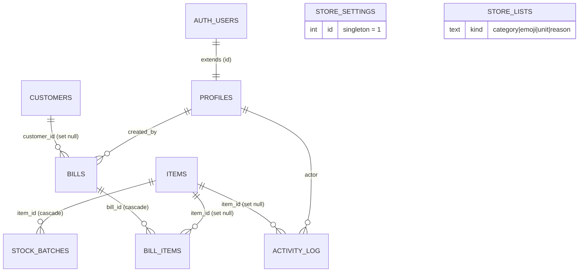

# Database Schema Reference — Bakers Theory (bt-store-management)

The consolidated, current-state reference for the Postgres/Supabase backend:
every table, view, RPC, and the privacy model that ties them together — plus the
**why** behind the shape.

> **Source of truth is the ordered SQL in `supabase/migrations/`.** This document
> is the merged, human-readable view of where those 27 migrations have landed. If
> the two ever disagree, the migrations win — and this file needs an update.
> For how the schema fits the app as a whole, see
> [`ARCHITECTURE.md`](./ARCHITECTURE.md) (§8 write path, §9 schema overview).

---

## 1. Design principles

Five decisions were locked in at migration time and still hold:

1. **Auth via Supabase Auth, keyed by a login handle.** Each numeric `userId`
   maps to a synthetic email `<userId>@bt.local`. Supabase stores the password
   and issues real JWT sessions; `profiles` extends `auth.users` with role +
   permissions.
2. **Single store (not multi-tenant).** One `store_settings` row (`id = 1`);
   items, bills, customers, and users are global.
3. **DB-enforced access control.** Row-Level Security (RLS) on every table is the
   real boundary — never just app checks. The client mirror in
   `src/lib/permissions.ts` only drives UI.
4. **The client never writes a table directly.** Every mutation is a
   `SECURITY DEFINER` RPC that re-checks permission server-side and runs
   atomically. Data tables have **no** client write policy.
5. **`cost_price` is private.** Column-level `SELECT` is revoked from the client
   role; cost is reachable only through analytics-gated definer functions.

**Extensions:** `pgcrypto` (for `gen_random_uuid()`).

---

## 2. Entity relationships



`store_settings` and `store_lists` stand alone (no FKs). `bill_items`,
`stock_batches`, `activity_log`, and `bills` snapshot names/prices so a row
survives deletion of the item or user it referenced (`on delete set null`).

---

## 3. Tables

DDL below is the **merged current state** (all migrations applied). Inline
comments flag columns added after `0001`.

### 3.1 `profiles` — users, roles, permissions

Extends `auth.users`. Permissions are three booleans (cleaner for RLS than JSONB).
A partial unique index enforces **at most one Owner**.

```sql
create table public.profiles (
  id             uuid primary key references auth.users(id) on delete cascade,
  user_id        text    not null unique,        -- login handle, e.g. '7873557430'
  name           text    not null,
  role           text    not null default 'Staff' check (role in ('Owner','Staff')),
  perm_sales     boolean not null default false,
  perm_inventory boolean not null default false,
  perm_analytics boolean not null default false,
  created_at     timestamptz not null default now()
);
create unique index one_owner on public.profiles ((role)) where role = 'Owner';
```

Rows are created automatically: the `handle_new_user` trigger on `auth.users`
copies `user_id` / `name` / `role` / `perm_*` out of `raw_user_meta_data` (set at
admin-create time).

### 3.2 `store_settings` — the singleton

One row, `id = 1`, holding the whole store profile + config. `check (id = 1)`
makes a second row impossible.

```sql
create table public.store_settings (
  id                 int  primary key default 1 check (id = 1),
  name               text not null default 'My Bakery',
  tagline            text not null default '',
  address            text not null default '',
  phone              text not null default '',
  gst                text not null default '',
  logo_url           text,                         -- base64 data URL (via update_logo)
  currency           text not null default '₹',
  tax_rate           numeric not null default 0,
  low_stock_alert    numeric not null default 5,
  updated_at         timestamptz not null default now(),
  expiring_soon_days integer not null default 3,   -- 0011
  is_open            boolean not null default true, -- 0017
  status_changed_at  timestamptz,                   -- 0017
  status_changed_by  text not null default ''       -- 0017: name snapshot
);
-- updated_at maintained by the shared set_updated_at() trigger.
```

### 3.3 `items` — the catalogue

`name_key` is a generated, lowercased/trimmed column with a unique constraint —
this reproduces the original app's "merge duplicate by name" behavior. `qty` is a
**maintained mirror** of `SUM(stock_batches.qty)`, not an independently-written
value (see [§7.1](#71-the-batchfifo-model)).

```sql
create table public.items (
  id         uuid primary key default gen_random_uuid(),
  name       text not null,
  name_key   text generated always as (lower(trim(name))) stored unique,
  emoji      text not null default '📦',
  category   text not null,
  unit       text not null,
  price      numeric not null default 0,   -- selling price
  cost_price numeric not null default 0,   -- PRIVATE — SELECT revoked (see §5)
  qty        numeric not null default 0,   -- mirror of SUM(batch qty)
  created_at timestamptz not null default now(),
  updated_at timestamptz not null default now(),
  tracks_expiry boolean not null default true, -- 0011
  image_url  text                              -- 0022: product image; null = use emoji
);
create index items_category_idx on public.items (category);
-- updated_at maintained by set_updated_at() trigger.
```

### 3.4 `stock_batches` — per-item expiry batches *(0011)*

The source of truth for on-hand quantity. FIFO = soonest expiry first, NULLs last.
`expiry_date IS NULL` means the batch never expires.

```sql
create table public.stock_batches (
  id          uuid primary key default gen_random_uuid(),
  item_id     uuid not null references public.items(id) on delete cascade,
  qty         numeric not null,
  expiry_date date,                       -- NULL = never expires
  created_at  timestamptz not null default now()
);
create index stock_batches_item_idx on public.stock_batches (item_id, expiry_date);
```

### 3.5 `bills` — sales headers

`bill_no` comes from a sequence (human-facing invoice number). Money columns are
`numeric(12,2)` (tightened from bare `numeric` in `0014` so fractional-paisa
drift can't be stored). `subtotal` is stored **gross**; tax is charged on the
discounted amount; `total = discounted subtotal + tax`.

```sql
create sequence bill_no_seq start 1001;

create table public.bills (
  id               uuid primary key default gen_random_uuid(),
  bill_no          bigint not null unique default nextval('bill_no_seq'),
  customer_name    text not null default '',
  customer_phone   text not null default '',
  customer_id      uuid references public.customers(id) on delete set null, -- 0009
  subtotal         numeric(12,2) not null,        -- 0014: was numeric
  tax              numeric(12,2) not null,         -- 0014
  total            numeric(12,2) not null,         -- 0014
  tax_rate         numeric not null,
  payment_method   text not null default 'Cash' check (payment_method in ('Cash','UPI')), -- 0007
  discount_percent numeric not null default 0 check (discount_percent between 0 and 100),  -- 0008
  discount_type    text not null default 'percent' check (discount_type in ('percent','flat')), -- 0026
  discount_amount  numeric(12,2) not null default 0, -- 0026: actual ₹ discounted
  status           text not null default 'active' check (status in ('active','cancelled')),
  created_at       timestamptz not null default now(),
  created_by       uuid references public.profiles(id) on delete set null,
  cancelled_at     timestamptz,
  cancelled_by     text                            -- name snapshot (survives user deletion)
);
create index bills_created_at_idx  on public.bills (created_at);
create index bills_status_idx      on public.bills (status);
create index bills_customer_id_idx on public.bills (customer_id); -- 0009
```

### 3.6 `bill_items` — sales line items (snapshots)

Lines are stored **relationally with snapshots** — `name` / `emoji` / `unit` /
`price` / `cost_price` / `image_url` are frozen at sale time so a later edit or
deletion of the item never rewrites history.

```sql
create table public.bill_items (
  id         uuid primary key default gen_random_uuid(),
  bill_id    uuid not null references public.bills(id) on delete cascade,
  item_id    uuid references public.items(id) on delete set null,
  name       text not null,                 -- snapshot
  emoji      text not null default '',       -- snapshot
  unit       text not null,                  -- snapshot
  qty        numeric not null,
  price      numeric not null,               -- snapshot selling price
  cost_price numeric not null default 0,     -- PRIVATE snapshot — SELECT revoked (§5)
  image_url  text                            -- 0022: snapshot of item image at sale time
);
create index bill_items_bill_id_idx on public.bill_items (bill_id);
create index bill_items_item_id_idx on public.bill_items (item_id);
```

### 3.7 `activity_log` — append-only audit trail

One table for every history event. `type` gates which columns are meaningful:
stock moves use `item_*`/`supplier`/`reason`, bill events use
`bill_no`/`items`/`total`, admin events use `notes`. The `check` list has grown
as features shipped.

```sql
create table public.activity_log (
  id         uuid primary key default gen_random_uuid(),
  type       text not null check (type in (
               'in','out','bill','cancel','delete',          -- 0001
               'open','close',                                -- 0017
               'settings','staff_add','staff_edit','staff_remove','password')), -- 0018
  created_at timestamptz not null default now(),
  actor      uuid references public.profiles(id) on delete set null, -- 0003
  -- stock movements
  item_id    uuid references public.items(id) on delete set null,
  item_name  text,
  qty        numeric,
  supplier   text,
  reason     text,
  notes      text,
  -- bill events
  bill_no    bigint,
  items      text,        -- comma-joined item names
  total      numeric
);
create index activity_log_created_at_idx on public.activity_log (created_at desc);
```

### 3.8 `customers` — directory *(0009)*

Identity is `phone`. Visit/spend stats are **computed on read** (see
`customers_with_stats` / `customer_by_phone`), never cached as columns — so
cancellations drop out automatically with zero drift.

```sql
create table public.customers (
  id         uuid primary key default gen_random_uuid(),
  phone      text not null unique,          -- identity (10-digit)
  name       text not null default '',
  first_seen timestamptz not null default now(),
  last_seen  timestamptz not null default now(),
  created_at timestamptz not null default now(),
  updated_at timestamptz not null default now()
);
-- updated_at maintained by set_updated_at() trigger.
```

### 3.9 `store_lists` — admin-managed option lists *(0006)*

Backs categories / emojis / units / stock-out reasons that used to be hardcoded
in `constants.ts`. Owner-managed via RPCs, readable by any authed user.

```sql
create table public.store_lists (
  id         uuid primary key default gen_random_uuid(),
  kind       text not null check (kind in ('category','emoji','unit','reason')),
  value      text not null,
  sort_order int  not null default 0,
  created_at timestamptz not null default now(),
  unique (kind, value)
);
create index store_lists_kind_idx on public.store_lists (kind, sort_order);
```

---

## 4. Views (the read surface)

The client reads `*_v` views, not base tables, wherever a view exists. They join
in derived fields and re-gate visibility. All are `SECURITY DEFINER` (default),
so they can read revoked/other-user columns and expose them only per the `where`
clause.

| View | Adds / does | Visibility gate |
|---|---|---|
| `items_v` | Appends `tracks_expiry`, `earliest_expiry`, `batches` (jsonb, in-stock only, FIFO-ordered), `image_url`; returns `cost_price` **only** to inventory/analytics (else `null`). | `SELECT` granted to `authenticated`; cost masked per-row. |
| `bills_v` | `b.* + biller_name` (joined from `profiles.created_by`). | `has_perm('sales') or has_perm('inventory')`. |
| `activity_log_v` | Log rows + `actor_name` (joined from `profiles`). | `has_perm('sales') or has_perm('inventory')`. |
| `activity_log_admin_v` | Same shape as `activity_log_v`, but **only** admin event types (`open`/`close`/`settings`/`staff_*`/`password`). | `is_owner()` — returns zero rows to non-owners. |

> `CREATE OR REPLACE VIEW` can only **append** columns, never reorder. Later
> migrations add columns at the end; the client reads with `select *` and maps by
> name, so order is irrelevant. `bills_v` uses `b.*`, which is frozen at creation
> — so adding a `bills` column requires a `drop view` + recreate (see `0026`).

---

## 5. Column privacy & grants

RLS is row-level and cannot hide a *column*. To make `cost_price` private:

```sql
-- 0002: drop the table-level SELECT, grant every column EXCEPT cost_price.
revoke select on public.items      from anon, authenticated;
grant  select (id, name, name_key, emoji, category, unit, price, qty,
               created_at, updated_at, tracks_expiry, image_url)
       on public.items to authenticated;

revoke select on public.bill_items from anon, authenticated;
grant  select (id, bill_id, item_id, name, emoji, unit, qty, price, image_url)
       on public.bill_items to authenticated;
```

Consequences that must be respected:

- **Never `select *` on `items` / `bill_items`** from the client — it errors on
  the revoked `cost_price` for non-privileged roles. Read `items_v` (cost masked)
  or list columns explicitly.
- **Cost reaches analytics only through gated definer functions:**
  `bill_lines_with_cost()` and `dashboard_stats(...)` check `has_perm('analytics')`
  and return cost / COGS as `null` otherwise.
- **The client type has no cost field to leak into** — mappers hard-code
  `costPrice: 0` on bill lines.
- **Adding a readable column requires a matching grant.** `0022` added
  `bill_items.image_url` but forgot the grant; `0024` fixed it (without it, direct
  `bill_items` reads returned zero rows for historical bills).

---

## 6. RPC catalog

Every mutation is a `SECURITY DEFINER` function that (1) re-checks permission,
(2) for inventory ops also calls `assert_store_open()` (non-owners are blocked
while the store is closed — `0019`), (3) runs atomically, (4) returns the affected
row for cache-patching or `void`. All are `grant execute … to authenticated`
unless marked *internal*.

### Helpers (RLS / guards)

| Function | Returns | Purpose |
|---|---|---|
| `my_role()` | `text` | Caller's role from `profiles`. |
| `is_owner()` | `boolean` | `my_role() = 'Owner'`. |
| `has_perm(perm text)` | `boolean` | Owner ⇒ true; else the matching `perm_*` flag. |
| `assert_store_open()` | `void` | *internal* — raises if store closed (Owner exempt). |
| `set_updated_at()` | trigger | *internal* — shared `updated_at` bump. |
| `handle_new_user()` | trigger | *internal* — creates a `profiles` row from `auth.users` metadata. |

### Items & inventory — gate: `inventory` (+ store-open)

| Function | Returns | Purpose |
|---|---|---|
| `create_item(p jsonb)` | `jsonb` (`kind` + full `items_v` row) | Add, or merge-by-`name_key`; seeds an initial batch. |
| `update_item(p_id uuid, p jsonb)` | `items_v` | Edit fields + `tracks_expiry`; **never** writes `qty`. Untracking collapses batches into one non-expiring batch. |
| `delete_item(p_id uuid)` | `void` | Delete (cascades batches). |
| `set_item_image(p_id uuid, p_url text)` | `items_v` | Persist/clear one item's image without touching other fields (`0023`). |
| `stock_in(p_item, p_qty, p_supplier, p_notes, p_expiry date)` | `items_v` | Add a batch (merges same expiry) + log `in`. |
| `stock_out(p_item, p_qty, p_reason, p_notes)` | `items_v` | FIFO-consume (incl. expired) + log `out`. |
| `write_off_batch(p_batch_id uuid)` | `items_v` | Delete one batch (e.g. expired) + log `out`. |
| `update_batch_expiry(p_batch_id, p_expiry date)` | `items_v` | Correct a best-before date; qty untouched (`0012`). |

*Internal batch helpers* (revoked from `public`, called only inside the above):
`add_batch(item, qty, expiry)`, `consume_fifo(item, qty)`,
`consume_fresh_fifo(item, qty, tz)` — see [§7.1](#71-the-batchfifo-model).

### Bills — gate: `sales`

| Function | Returns | Purpose |
|---|---|---|
| `generate_bill(customer jsonb, lines jsonb, p_tz text = 'UTC')` | `bills` | The core transaction — see [§7.2](#72-generate_bill-anatomy). Blocked when the store is closed. |
| `cancel_bill(p_id uuid, p_by text)` | `void` | Flip to `cancelled`, restore stock as a non-expiring batch, log `cancel`. |
| `delete_bill(p_id uuid, p_by text)` | `void` | Hard-delete (cascades lines); restores stock only if the bill was still active. Logs `delete`. |

### Customers — gate: `sales` | `inventory`

| Function | Returns | Purpose |
|---|---|---|
| `customers_with_stats()` | `table` | Directory + visit/spend/last-purchase from **active** bills. |
| `customer_by_phone(p_phone text)` | `table` | Indexed single-customer lookup for checkout autofill (cheaper than the full directory). |
| `update_customer(p_id, p_name, p_phone)` | `customers` | Correct a name/phone typed at billing; unique-phone enforced. |

### Store / settings — gate: `Owner` (`is_owner()`)

| Function | Returns | Purpose |
|---|---|---|
| `save_settings(p jsonb)` | `void` | Update the singleton; logs a `settings` event. |
| `update_logo(p_url text)` | `void` | Set `logo_url`. |
| `set_store_status(p_open boolean, p_by text)` | `void` | Open/close the store; records who/when + logs `open`/`close`. |
| `clear_all_data()` | `void` | Wipe bills/batches/items/log, restart `bill_no_seq` at 1001. |
| `log_password_change()` | `void` | *(any authed user)* record a `password` event after a self password change. |

### Lists — gate: `Owner`

| Function | Returns | Purpose |
|---|---|---|
| `add_list_value(p_kind text, p_value text)` | `void` | Append a category/emoji/unit/reason. |
| `delete_list_value(p_id uuid)` | `void` | Remove one; refuses if a category/unit is still in use. |

### Analytics / cost-gated reads — gate: `analytics`

| Function | Returns | Purpose |
|---|---|---|
| `bill_lines_with_cost()` | `table` (incl. `cost_price`) | Cost-bearing bill lines for the Excel COGS/profit export; empty for non-analytics. |
| `dashboard_stats(p_tz text = 'UTC', p_from date = null, p_to date = null)` | `jsonb` | Server-side KPI aggregation for a local-day range, with a previous-period comparison. `cogs` is `null` for non-analytics users. |

---

## 7. Deep dives

### 7.1 The batch / FIFO model

Before `0011`, `items.qty` was the authoritative quantity. `0011` made
`stock_batches` the source of truth and demoted `items.qty` to a **mirror**
(`SUM(batch.qty)`), recomputed by the batch helpers after every change. Existing
stock was backfilled as one non-expiring batch per item.

- **`add_batch(item, qty, expiry)`** — merges into the batch with the same
  `expiry_date` (NULL merges into the single non-expiring batch), else inserts;
  then refreshes `items.qty`. Forces `expiry = NULL` when the item doesn't track
  expiry.
- **`consume_fifo(item, qty)`** — draws down batches ordered
  `expiry_date asc nulls last, created_at asc`, clamped at 0 (never negative),
  deletes emptied batches, refreshes `items.qty`. Used by **manual** `stock_out`
  (which may legitimately target expired stock).
- **`consume_fresh_fifo(item, qty, tz)`** *(0020)* — same, but **skips batches
  whose `expiry_date < today`** (today computed in the client's `tz`). Used by
  `generate_bill` so a sale can never silently deduct expired stock.

`items_v.batches` exposes only in-stock (`qty > 0`) batches, FIFO-ordered, as
jsonb — but **includes expired ones**; the bill page filters those out locally so
it sells/shows only fresh stock. Cancel/delete restore returns stock as a
**non-expiring** batch (the originally-consumed batches are unrecoverable).

### 7.2 `generate_bill` anatomy

The one function where several invariants meet. Current signature:
`generate_bill(customer jsonb, lines jsonb, p_tz text default 'UTC')`. In order:

1. **Gate:** `has_perm('sales')`, then reject if the store is closed.
2. **Price pass:** loop `lines`, `select … for update` each item (row-lock against
   concurrent stock changes), sum `qty * price` → `subtotal` (rounded to 2dp).
3. **Customer upsert:** only when a phone is present (`0010` made phone optional —
   phone-less = anonymous walk-in, `customer_id` stays NULL). Upsert by phone,
   keep the latest non-empty name, bump `last_seen`.
4. **Discount + tax:** `discount_type` selects percent (clamp 0–100) or flat
   (clamp ₹-off to subtotal); tax is charged on the **discounted** taxable amount;
   every step rounded to 2dp (`0014`).
5. **Insert** the `bills` row (payment method, both discount representations,
   `created_by = auth.uid()`).
6. **Line pass:** insert each `bill_items` snapshot (incl. `image_url`) and
   `consume_fresh_fifo` its quantity.
7. **Log** a `bill` activity row and return the new `bills` row.

The whole thing is one transaction — a failure anywhere rolls back stock,
customer, bill, and log together.

### 7.3 Local-day ↔ UTC

`timestamptz` columns are filtered by the **user's** calendar day, not the
server's. `dashboard_stats` and `generate_bill` take an IANA `p_tz` and decide
day boundaries / batch freshness server-side; the client passes the same tz and
converts local `YYYY-MM-DD` to UTC instants for history filters and the Excel
export. This must stay consistent across dashboard, history, billing, and export.

---

## 8. Migration history

`0001` init (tables, RLS, helpers, core RPCs) · `0002` cost privacy + logo ·
`0003` activity-log actor view · `0004` dashboard stats · `0005` bill-line cost id ·
`0006` store_lists · `0007` payment method · `0008` percent discount ·
`0009` customers · `0010` optional customer phone · `0011` stock batches ·
`0012` edit batch expiry · `0013` biller-name view · `0014` round bill totals +
`numeric(12,2)` · `0015` customer-by-phone lookup · `0016` mutations return the item
row · `0017` store open/closed status · `0018` store/staff admin audit +
admin view · `0019` closed store blocks inventory · `0020` bills skip expired
batches · `0021` dashboard stats by range · `0022`/`0023` product images ·
`0024` grant `bill_items.image_url` · `0025` dashboard prev-period counts ·
`0026` flat discount · `0027` update customer.

Apply in order via the Supabase SQL editor or `supabase db push`.

---

## 9. Conventions for changing the schema

1. **New numbered migration** — never edit a shipped one. Reproduce the current
   function body and change only what's needed (later files do this verbatim; the
   header comment says which prior version it's based on).
2. **A new mutation is a new RPC** — `SECURITY DEFINER`, permission check first,
   `assert_store_open()` if it's an inventory op, atomic body, return the affected
   row for cache-patching. Then add the `rpc*` wrapper in
   `lib/supabase-data.ts` and the store action.
3. **Changing an RPC's argument list** requires `drop function` first (overloads
   are ambiguous otherwise). Same signature ⇒ `create or replace` needs no re-grant.
4. **A new readable column** on `items`/`bill_items` needs an explicit column
   `grant` (unless it's cost-sensitive). Surfacing it on a `b.*` view (`bills_v`)
   needs a `drop view` + recreate.
5. **Never expose `cost_price`** to the client role — route any cost-aware feature
   through an analytics-gated definer function.
6. **Keep `permissions.ts` in sync** with the SQL policy/helper model — but
   remember RLS is the boundary, not the client mirror.
```